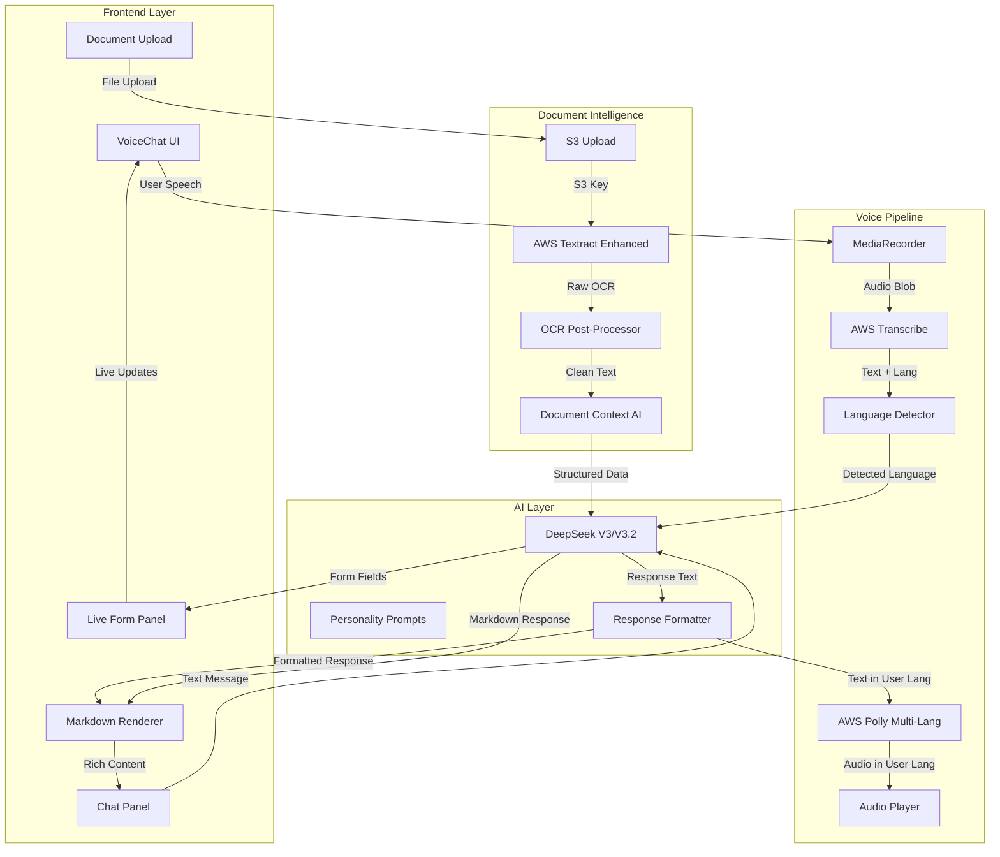
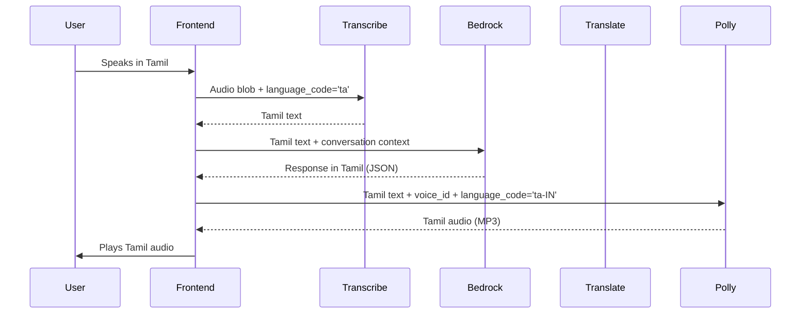
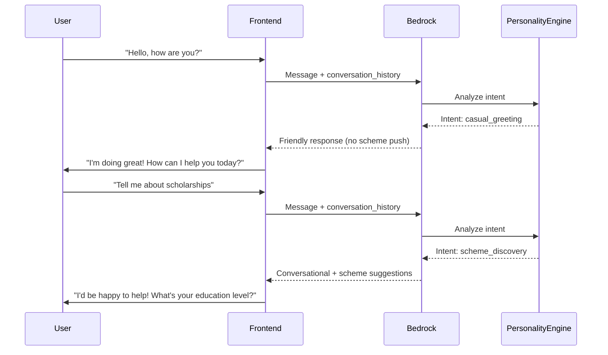
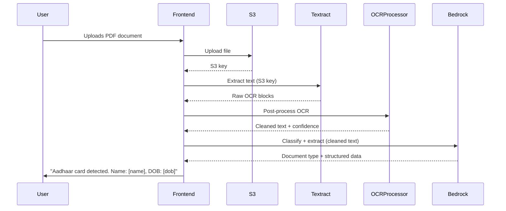
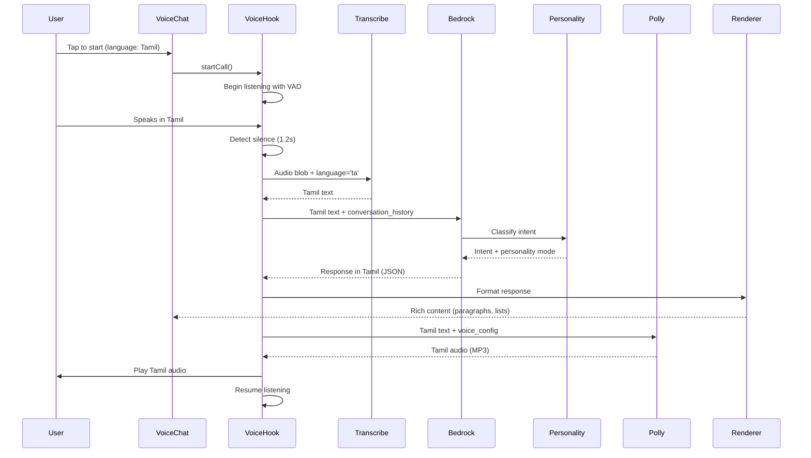

# Design Document: Enhanced Multilingual Conversational AI

## Overview

This design addresses five critical improvements to the CivicBridge voice-first AI platform, which serves 400 million Indians with low digital literacy across 16 Indian languages. The platform uses DeepSeek V3/V3.2 via AWS Bedrock for conversational AI, with AWS Polly for text-to-speech, AWS Transcribe for speech-to-text, and AWS Textract for document processing.

The core problems being solved are: (1) Voice output only speaks English despite user language selection, (2) AI personality is too transactional and scheme-focused, (3) Chat responses lack rich formatting (paragraphs, lists, images), (4) UI/UX components are disorganized with missing features like live form filling panel and document upload button, and (5) PDF reading accuracy is poor due to inadequate document intelligence pipeline.

This design provides a comprehensive solution combining multilingual voice pipeline enhancements, conversational AI personality improvements, rich content rendering, UI reorganization, and enhanced document processing capabilities.

## Architecture



## Sequence Diagrams

### Multilingual Voice Interaction Flow




### Conversational AI Personality Flow



### Enhanced Document Processing Flow




## Components and Interfaces

### Component 1: Multilingual Voice Service

**Purpose**: Ensure voice output matches user's selected language by properly configuring AWS Polly with language-specific voices and SSML.

**Interface**:
```python
class MultilingualPollyService:
    def synthesize_speech(
        self,
        text: str,
        language: str,
        voice_config: Optional[Dict] = None
    ) -> Dict[str, Any]:
        """
        Synthesize speech in the user's selected language.
        
        Args:
            text: Text to convert to speech
            language: Language code (hi, ta, te, bn, etc.)
            voice_config: Optional voice configuration override
            
        Returns:
            {
                "audio_base64": str,
                "content_type": str,
                "language": str,
                "voice_id": str
            }
        """
        pass
    
    def get_voice_for_language(self, language: str) -> Dict[str, str]:
        """Get optimal voice configuration for language."""
        pass
```

**Responsibilities**:
- Map language codes to appropriate Polly voices
- Generate SSML with correct language tags
- Handle fallback voices when language not supported
- Return audio in correct language encoding


### Component 2: Conversational Personality Engine

**Purpose**: Transform AI from transactional scheme-pusher to friendly conversational assistant that builds rapport before discussing schemes.

**Interface**:
```python
class PersonalityEngine:
    def enhance_prompt(
        self,
        base_prompt: str,
        conversation_history: List[Dict],
        user_profile: Dict
    ) -> str:
        """
        Enhance system prompt with personality directives.
        
        Args:
            base_prompt: Base system prompt
            conversation_history: Previous messages
            user_profile: User context
            
        Returns:
            Enhanced prompt with personality instructions
        """
        pass
    
    def classify_intent(self, message: str) -> str:
        """
        Classify user intent to determine response style.
        
        Returns one of:
        - casual_greeting
        - casual_conversation
        - scheme_discovery
        - eligibility_check
        - document_help
        - application_start
        """
        pass
    
    def should_suggest_schemes(
        self,
        intent: str,
        conversation_stage: int
    ) -> bool:
        """Determine if schemes should be suggested now."""
        pass
```

**Responsibilities**:
- Inject personality directives into system prompts
- Classify user intent to determine response style
- Control when to transition from casual to scheme-focused
- Maintain conversational flow and rapport


### Component 3: Rich Content Renderer

**Purpose**: Transform plain text AI responses into rich formatted content with paragraphs, lists, images, and cards.

**Interface**:
```typescript
interface RichContentRenderer {
  renderMarkdown(
    content: string,
    options?: RenderOptions
  ): React.ReactElement;
  
  parseStructuredResponse(
    response: AIResponse
  ): StructuredContent;
  
  renderSchemeCard(
    scheme: SchemeData
  ): React.ReactElement;
  
  renderDocumentCard(
    document: DocumentData
  ): React.ReactElement;
}

interface StructuredContent {
  paragraphs: string[];
  bulletLists: string[][];
  numberedLists: string[][];
  images: ImageData[];
  cards: CardData[];
}

interface RenderOptions {
  enableImages: boolean;
  enableCards: boolean;
  maxImageWidth: number;
  theme: 'light' | 'dark';
}
```

**Responsibilities**:
- Parse markdown from AI responses
- Render paragraphs with proper spacing
- Render bullet and numbered lists
- Display images with proper sizing
- Render scheme and document cards
- Apply consistent styling and theming


### Component 4: Live Form Filling Panel

**Purpose**: Display real-time form filling progress as AI collects information from user, showing which fields are populated and which are pending.

**Interface**:
```typescript
interface LiveFormPanel {
  updateField(
    fieldName: string,
    value: any,
    source: 'user' | 'document' | 'ai_inferred'
  ): void;
  
  getFormState(): FormState;
  
  renderFormPreview(): React.ReactElement;
  
  highlightMissingFields(): string[];
}

interface FormState {
  scheme_id: string;
  scheme_name: string;
  fields: FormField[];
  completion_percentage: number;
  missing_fields: string[];
  validation_errors: ValidationError[];
}

interface FormField {
  name: string;
  label: string;
  value: any;
  source: 'user' | 'document' | 'ai_inferred';
  confidence: number;
  required: boolean;
  filled: boolean;
}
```

**Responsibilities**:
- Track form field population in real-time
- Display visual progress indicator
- Highlight missing required fields
- Show data source for each field (user, document, AI)
- Provide field-level confidence scores
- Allow user to edit AI-filled values


### Component 5: Enhanced Document Intelligence Pipeline

**Purpose**: Improve PDF reading accuracy through enhanced OCR post-processing, context-aware extraction, and AI-powered document understanding.

**Interface**:
```python
class EnhancedDocumentPipeline:
    def process_document(
        self,
        file_bytes: bytes,
        file_type: str,
        user_context: Optional[Dict] = None
    ) -> DocumentResult:
        """
        Process document with enhanced intelligence.
        
        Args:
            file_bytes: Raw file bytes
            file_type: File extension (pdf, jpg, png)
            user_context: User profile for context-aware extraction
            
        Returns:
            DocumentResult with structured data
        """
        pass
    
    def post_process_ocr(
        self,
        raw_ocr: str,
        confidence_scores: List[float]
    ) -> str:
        """Clean and correct OCR errors."""
        pass
    
    def extract_with_context(
        self,
        clean_text: str,
        document_type: str,
        user_context: Dict
    ) -> Dict[str, Any]:
        """Extract structured data using AI with user context."""
        pass
```

**Responsibilities**:
- Perform OCR with AWS Textract
- Post-process OCR to fix common errors
- Use AI to extract structured data
- Validate extracted data against expected formats
- Use user context to improve extraction accuracy
- Handle multi-page PDFs correctly


## Data Models

### Model 1: VoiceConfiguration

```python
class VoiceConfiguration:
    language: str  # Language code (hi, ta, te, etc.)
    voice_id: str  # Polly voice ID
    engine: str  # 'neural' or 'standard'
    language_code: str  # SSML language code (hi-IN, ta-IN, etc.)
    speaking_rate: float  # 0.5 to 2.0
    pitch: str  # 'x-low', 'low', 'medium', 'high', 'x-high'
```

**Validation Rules**:
- language must be one of supported languages
- voice_id must exist in AWS Polly
- speaking_rate must be between 0.5 and 2.0
- engine must be 'neural' or 'standard'

### Model 2: ConversationContext

```python
class ConversationContext:
    conversation_id: str
    user_id: str
    language: str
    conversation_stage: str  # 'greeting', 'rapport', 'discovery', 'application'
    intent_history: List[str]
    personality_mode: str  # 'friendly', 'professional', 'casual'
    scheme_suggestions_count: int
    last_scheme_mention: Optional[datetime]
```

**Validation Rules**:
- conversation_stage must be valid stage
- personality_mode must be valid mode
- scheme_suggestions_count >= 0


### Model 3: FormattedResponse

```typescript
interface FormattedResponse {
  message: string;  // Raw text
  formatted_content: {
    type: 'markdown' | 'structured';
    paragraphs?: string[];
    lists?: {
      type: 'bullet' | 'numbered';
      items: string[];
    }[];
    images?: {
      url: string;
      alt: string;
      caption?: string;
    }[];
    cards?: {
      type: 'scheme' | 'document' | 'info';
      data: any;
    }[];
  };
  intent: string;
  detected_language: string;
  suggested_schemes?: string[];
  suggested_actions?: Action[];
}
```

**Validation Rules**:
- message must not be empty
- formatted_content.type must be valid
- If type is 'structured', at least one content element must exist
- All image URLs must be valid

### Model 4: DocumentExtractionResult

```python
class DocumentExtractionResult:
    document_id: str
    document_type: str
    confidence: float  # 0.0 to 1.0
    extracted_data: Dict[str, Any]
    raw_ocr_text: str
    cleaned_text: str
    validation_status: str  # 'valid', 'needs_review', 'invalid'
    extraction_errors: List[str]
    ai_generated_name: str
```

**Validation Rules**:
- confidence must be between 0.0 and 1.0
- document_type must be recognized type
- validation_status must be valid status
- extracted_data must contain at least one field


## Main Algorithm/Workflow




## Key Functions with Formal Specifications

### Function 1: synthesize_multilingual_speech()

```python
def synthesize_multilingual_speech(
    text: str,
    language: str,
    voice_config: Optional[Dict] = None
) -> Dict[str, Any]:
    """
    Synthesize speech in user's selected language using AWS Polly.
    """
```

**Preconditions:**
- `text` is non-empty string
- `language` is valid language code from supported set
- `voice_config` (if provided) contains valid Polly parameters

**Postconditions:**
- Returns dictionary with `audio_base64`, `content_type`, `language`, `voice_id`
- Audio is in the specified language
- If language not supported, falls back to English with warning
- No exceptions raised for valid inputs

**Loop Invariants:** N/A (no loops)

### Function 2: enhance_prompt_with_personality()

```python
def enhance_prompt_with_personality(
    base_prompt: str,
    conversation_history: List[Dict],
    intent: str,
    conversation_stage: str
) -> str:
    """
    Enhance system prompt with personality directives based on conversation context.
    """
```

**Preconditions:**
- `base_prompt` is non-empty string
- `conversation_history` is list of message dictionaries
- `intent` is valid intent classification
- `conversation_stage` is valid stage

**Postconditions:**
- Returns enhanced prompt string
- Enhanced prompt contains personality directives
- If stage is 'greeting' or 'rapport', prompt discourages scheme pushing
- If stage is 'discovery' or 'application', prompt allows scheme suggestions
- Original base_prompt content is preserved

**Loop Invariants:** N/A (no loops)


### Function 3: render_markdown_to_react()

```typescript
function renderMarkdownToReact(
  markdown: string,
  options: RenderOptions
): React.ReactElement
```

**Preconditions:**
- `markdown` is valid string (may be empty)
- `options` contains valid render configuration

**Postconditions:**
- Returns React element tree
- Paragraphs are wrapped in `<p>` tags with proper spacing
- Bullet lists are rendered as `<ul>` with `<li>` items
- Numbered lists are rendered as `<ol>` with `<li>` items
- Images are rendered with proper sizing and alt text
- All HTML is sanitized to prevent XSS

**Loop Invariants:**
- For markdown parsing loop: All previously parsed blocks are valid React elements
- For list rendering loop: All list items maintain consistent styling

### Function 4: process_document_with_intelligence()

```python
def process_document_with_intelligence(
    file_bytes: bytes,
    file_type: str,
    user_context: Optional[Dict] = None
) -> DocumentExtractionResult:
    """
    Process document with enhanced OCR and AI extraction.
    """
```

**Preconditions:**
- `file_bytes` is non-empty byte array
- `file_type` is supported format (pdf, jpg, png, etc.)
- `user_context` (if provided) contains valid user profile data

**Postconditions:**
- Returns DocumentExtractionResult with structured data
- `confidence` score is between 0.0 and 1.0
- `cleaned_text` has fewer errors than `raw_ocr_text`
- `extracted_data` contains at least document type
- If confidence < 0.7, `validation_status` is 'needs_review'

**Loop Invariants:**
- For OCR block processing: All processed blocks maintain text order
- For error correction loop: Confidence scores are non-decreasing


### Function 5: update_live_form_field()

```typescript
function updateLiveFormField(
  fieldName: string,
  value: any,
  source: 'user' | 'document' | 'ai_inferred',
  confidence: number
): void
```

**Preconditions:**
- `fieldName` is non-empty string matching a form field
- `value` is appropriate type for the field
- `source` is valid source type
- `confidence` is between 0.0 and 1.0

**Postconditions:**
- Form state is updated with new field value
- Field is marked as filled
- UI reflects the update within 100ms
- If confidence < 0.8, field is highlighted for user review
- Form completion percentage is recalculated

**Loop Invariants:** N/A (no loops)

## Algorithmic Pseudocode

### Main Processing Algorithm: Multilingual Voice Pipeline

```pascal
ALGORITHM processMultilingualVoiceInteraction(audioBlob, userLanguage)
INPUT: audioBlob (audio recording), userLanguage (language code)
OUTPUT: audioResponse (speech in user's language)

BEGIN
  ASSERT audioBlob IS NOT NULL
  ASSERT userLanguage IN SUPPORTED_LANGUAGES
  
  // Step 1: Transcribe audio to text in user's language
  transcriptionResult ← transcribeAudio(audioBlob, userLanguage)
  userText ← transcriptionResult.text
  detectedLanguage ← transcriptionResult.language
  
  ASSERT userText IS NOT EMPTY
  
  // Step 2: Get AI response with personality enhancement
  conversationContext ← getConversationContext()
  intent ← classifyIntent(userText, conversationContext)
  enhancedPrompt ← enhancePromptWithPersonality(
    BASE_PROMPT, 
    conversationContext.history,
    intent,
    conversationContext.stage
  )
  
  aiResponse ← callBedrockAI(userText, enhancedPrompt, detectedLanguage)
  responseText ← aiResponse.message
  
  ASSERT responseText IS NOT EMPTY
  ASSERT aiResponse.detected_language = detectedLanguage
  
  // Step 3: Synthesize speech in user's language
  voiceConfig ← getVoiceConfigForLanguage(detectedLanguage)
  audioResponse ← synthesizeMultilingualSpeech(
    responseText,
    detectedLanguage,
    voiceConfig
  )
  
  ASSERT audioResponse.language = detectedLanguage
  ASSERT audioResponse.audio_base64 IS NOT EMPTY
  
  // Step 4: Update UI with formatted response
  formattedContent ← formatResponseContent(aiResponse)
  updateChatUI(formattedContent)
  
  RETURN audioResponse
END
```

**Preconditions:**
- audioBlob contains valid audio data
- userLanguage is one of 16 supported Indian languages
- AWS services (Transcribe, Bedrock, Polly) are available

**Postconditions:**
- Audio response is in the same language as user input
- Chat UI displays formatted response
- Conversation context is updated
- No data loss or language mismatch

**Loop Invariants:** N/A (sequential processing)


### Personality Enhancement Algorithm

```pascal
ALGORITHM enhancePromptWithPersonality(basePrompt, conversationHistory, intent, stage)
INPUT: basePrompt (string), conversationHistory (list), intent (string), stage (string)
OUTPUT: enhancedPrompt (string)

BEGIN
  ASSERT basePrompt IS NOT EMPTY
  ASSERT stage IN ['greeting', 'rapport', 'discovery', 'application']
  
  enhancedPrompt ← basePrompt
  
  // Add personality directives based on stage
  IF stage = 'greeting' OR stage = 'rapport' THEN
    personalityDirective ← "
      IMPORTANT PERSONALITY RULES:
      - Be warm, friendly, and conversational
      - Engage in casual conversation naturally
      - DO NOT immediately push schemes or ask eligibility questions
      - Build rapport first - ask how they're doing, show empathy
      - Only mention schemes if user explicitly asks
      - Make it feel like talking to a helpful friend, not a government form
    "
    enhancedPrompt ← enhancedPrompt + personalityDirective
  
  ELSE IF stage = 'discovery' THEN
    personalityDirective ← "
      PERSONALITY RULES:
      - Maintain friendly tone while being helpful
      - Suggest schemes conversationally, not as a list dump
      - Ask clarifying questions naturally
      - Show enthusiasm about helping them find benefits
      - Use phrases like 'I found something that might help you' instead of 'Eligible schemes:'
    "
    enhancedPrompt ← enhancedPrompt + personalityDirective
  
  ELSE IF stage = 'application' THEN
    personalityDirective ← "
      PERSONALITY RULES:
      - Be encouraging and supportive
      - Explain each step clearly
      - Celebrate progress ('Great! We're halfway done')
      - Be patient with questions
      - Maintain warmth while being efficient
    "
    enhancedPrompt ← enhancedPrompt + personalityDirective
  END IF
  
  // Add intent-specific guidance
  IF intent = 'casual_greeting' OR intent = 'casual_conversation' THEN
    enhancedPrompt ← enhancedPrompt + "
      The user is making casual conversation. Respond naturally without mentioning schemes.
    "
  END IF
  
  RETURN enhancedPrompt
END
```

**Preconditions:**
- basePrompt contains core system instructions
- conversationHistory is valid list (may be empty)
- intent and stage are valid classifications

**Postconditions:**
- Enhanced prompt contains personality directives
- Directives match the conversation stage
- Original basePrompt content is preserved
- Enhanced prompt guides AI to appropriate behavior

**Loop Invariants:** N/A (conditional logic only)


### Document Intelligence Processing Algorithm

```pascal
ALGORITHM processDocumentWithIntelligence(fileBytes, fileType, userContext)
INPUT: fileBytes (bytes), fileType (string), userContext (dict)
OUTPUT: documentResult (DocumentExtractionResult)

BEGIN
  ASSERT fileBytes IS NOT EMPTY
  ASSERT fileType IN SUPPORTED_FORMATS
  
  // Step 1: Extract raw OCR text
  rawOCR ← callTextractAPI(fileBytes)
  rawText ← rawOCR.full_text
  confidenceScores ← rawOCR.confidence_scores
  
  ASSERT rawText IS NOT EMPTY
  
  // Step 2: Post-process OCR to fix errors
  cleanedText ← ""
  FOR each line IN rawOCR.lines DO
    ASSERT line.confidence >= 0.0 AND line.confidence <= 100.0
    
    // Fix common OCR errors
    correctedLine ← line.text
    correctedLine ← fixCommonOCRErrors(correctedLine)
    correctedLine ← correctWithContext(correctedLine, userContext)
    
    cleanedText ← cleanedText + correctedLine + "\n"
  END FOR
  
  ASSERT LENGTH(cleanedText) >= LENGTH(rawText) * 0.8  // Sanity check
  
  // Step 3: Classify document type with AI
  classificationPrompt ← buildClassificationPrompt(cleanedText)
  classification ← callBedrockAI(classificationPrompt)
  documentType ← classification.document_type
  confidence ← classification.confidence
  
  ASSERT confidence >= 0.0 AND confidence <= 1.0
  
  // Step 4: Extract structured data with context
  extractionPrompt ← buildExtractionPrompt(
    cleanedText,
    documentType,
    userContext
  )
  extraction ← callBedrockAI(extractionPrompt)
  structuredData ← extraction.extracted_data
  
  // Step 5: Validate extracted data
  validationStatus ← "valid"
  validationErrors ← []
  
  IF confidence < 0.7 THEN
    validationStatus ← "needs_review"
    validationErrors.ADD("Low confidence extraction")
  END IF
  
  IF NOT validateDataFormat(structuredData, documentType) THEN
    validationStatus ← "needs_review"
    validationErrors.ADD("Data format validation failed")
  END IF
  
  // Step 6: Generate AI-friendly filename
  aiGeneratedName ← generateDocumentName(structuredData, documentType)
  
  // Build result
  documentResult ← DocumentExtractionResult(
    document_type: documentType,
    confidence: confidence,
    extracted_data: structuredData,
    raw_ocr_text: rawText,
    cleaned_text: cleanedText,
    validation_status: validationStatus,
    extraction_errors: validationErrors,
    ai_generated_name: aiGeneratedName
  )
  
  RETURN documentResult
END
```

**Preconditions:**
- fileBytes contains valid document data
- fileType is supported format (pdf, jpg, png, etc.)
- userContext may be null or contain user profile data

**Postconditions:**
- Returns DocumentExtractionResult with all fields populated
- cleanedText has fewer errors than rawText
- confidence score reflects extraction quality
- validationStatus indicates if manual review needed
- structuredData contains at least document type

**Loop Invariants:**
- For OCR line processing: All processed lines maintain original order
- For OCR line processing: Confidence scores remain in valid range [0, 100]
- For validation loop: validationErrors list only grows (never shrinks)


### Rich Content Rendering Algorithm

```pascal
ALGORITHM renderMarkdownToReact(markdown, options)
INPUT: markdown (string), options (RenderOptions)
OUTPUT: reactElement (React.ReactElement)

BEGIN
  ASSERT markdown IS NOT NULL  // May be empty string
  ASSERT options IS VALID
  
  // Step 1: Parse markdown into tokens
  tokens ← parseMarkdown(markdown)
  elements ← []
  
  // Step 2: Process each token and convert to React element
  FOR each token IN tokens DO
    IF token.type = 'paragraph' THEN
      element ← <p className="mb-3 text-sm leading-relaxed">{token.text}</p>
      elements.ADD(element)
    
    ELSE IF token.type = 'bullet_list' THEN
      listItems ← []
      FOR each item IN token.items DO
        listItems.ADD(<li className="mb-1">{item}</li>)
      END FOR
      element ← <ul className="list-disc list-inside mb-3 space-y-1">{listItems}</ul>
      elements.ADD(element)
    
    ELSE IF token.type = 'numbered_list' THEN
      listItems ← []
      FOR each item IN token.items DO
        listItems.ADD(<li className="mb-1">{item}</li>)
      END FOR
      element ← <ol className="list-decimal list-inside mb-3 space-y-1">{listItems}</ol>
      elements.ADD(element)
    
    ELSE IF token.type = 'image' AND options.enableImages THEN
      // Sanitize URL to prevent XSS
      safeURL ← sanitizeURL(token.url)
      element ← 
      IF token.caption THEN
        element ← <figure>{element}<figcaption>{token.caption}</figcaption></figure>
      END IF
      elements.ADD(element)
    
    ELSE IF token.type = 'heading' THEN
      level ← token.level
      element ← <h{level} className="font-semibold mb-2">{token.text}</h{level}>
      elements.ADD(element)
    
    END IF
  END FOR
  
  // Step 3: Wrap all elements in container
  reactElement ← <div className="rich-content">{elements}</div>
  
  RETURN reactElement
END
```

**Preconditions:**
- markdown is valid string (may be empty)
- options contains valid configuration
- options.maxImageWidth > 0 if images enabled

**Postconditions:**
- Returns valid React element tree
- All HTML is sanitized (no XSS vulnerabilities)
- Elements have consistent styling via Tailwind classes
- Images respect maxImageWidth constraint
- Empty markdown returns empty div

**Loop Invariants:**
- For token processing loop: All processed tokens are valid React elements
- For list item loops: All items maintain consistent styling
- For token processing loop: elements array only contains valid React elements


## Example Usage

### Example 1: Multilingual Voice Interaction (Tamil)

```python
# Backend: Process voice in Tamil
from app.services.polly_service import polly_service
from app.services.bedrock_service import bedrock_service

# User speaks in Tamil, transcribed text received
user_text_tamil = "வணக்கம், எனக்கு கல்வி உதவித்தொகை பற்றி தெரிந்து கொள்ள வேண்டும்"
language = "ta"

# Get AI response in Tamil
response = bedrock_service.chat(
    user_message=user_text_tamil,
    conversation_history=[],
    language=language
)

# Synthesize speech in Tamil
audio_result = polly_service.synthesize(
    text=response["message"],
    language=language,
    output_format="mp3"
)

# Result: audio_result contains Tamil speech
assert audio_result["language"] == "ta"
assert audio_result["audio_base64"] != ""
```

### Example 2: Conversational Personality (Casual Greeting)

```python
# User starts with casual greeting
user_message = "Hello! How are you today?"
conversation_history = []

# AI responds conversationally without pushing schemes
response = bedrock_service.chat(
    user_message=user_message,
    conversation_history=conversation_history,
    language="en"
)

# Expected response: Friendly greeting, no scheme mention
# "Hello! I'm doing great, thank you for asking! How can I help you today?"
assert "scheme" not in response["message"].lower()
assert response["intent"] == "casual_greeting"
```

### Example 3: Rich Content Rendering

```typescript
// Frontend: Render AI response with formatting
import { RichContentRenderer } from './components/RichContentRenderer';

const aiResponse = {
  message: `Here are some scholarships for you:

**PM Scholarship Scheme**
- Amount: ₹36,000 per year
- Eligibility: Children of armed forces personnel
- Application: Online through NSP portal

**NSP Pre-Matric Scholarship**
- Amount: ₹1,000 to ₹10,000
- Eligibility: SC/ST/OBC students
- Application: State-specific portals

Would you like to apply for any of these?`,
  formatted_content: {
    type: 'markdown'
  }
};

// Render with rich formatting
<RichContentRenderer 
  content={aiResponse.message}
  options={{
    enableImages: true,
    enableCards: true,
    theme: 'dark'
  }}
/>

// Result: Displays formatted content with:
// - Bold headings
// - Bullet lists with proper spacing
// - Consistent styling
```


### Example 4: Live Form Filling Panel

```typescript
// Frontend: Update form as AI collects information
import { LiveFormPanel } from './components/LiveFormPanel';

const formPanel = new LiveFormPanel({
  scheme_id: 'EDU001',
  scheme_name: 'PM Scholarship'
});

// AI extracts name from conversation
formPanel.updateField('applicant_name', 'Rajesh Kumar', 'user', 0.95);

// AI extracts DOB from Aadhaar document
formPanel.updateField('date_of_birth', '1995-06-15', 'document', 0.98);

// AI infers state from conversation context
formPanel.updateField('state', 'Tamil Nadu', 'ai_inferred', 0.85);

// Get current form state
const state = formPanel.getFormState();
console.log(state.completion_percentage); // 60%
console.log(state.missing_fields); // ['annual_income', 'category', 'bank_account']

// Render live preview
<LiveFormPanel 
  formState={state}
  onFieldEdit={(field, newValue) => {
    formPanel.updateField(field, newValue, 'user', 1.0);
  }}
/>
```

### Example 5: Enhanced Document Processing

```python
# Backend: Process PDF with enhanced intelligence
from app.services.textract_service import textract_service
from app.services.bedrock_service import bedrock_service

# Read PDF file
with open('aadhaar_card.pdf', 'rb') as f:
    file_bytes = f.read()

# Extract with Textract
raw_ocr = textract_service.extract_text(file_bytes)
raw_text = raw_ocr["full_text"]
confidence = raw_ocr["confidence"]

# Post-process OCR errors
cleaned_text = post_process_ocr(raw_text, confidence)

# Use AI to extract structured data with user context
user_context = {
    "name": "Rajesh Kumar",  # From profile
    "state": "Tamil Nadu"
}

classification = bedrock_service.classify_document(cleaned_text)
document_type = classification["document_type"]  # "aadhaar"

# Extract structured data
extracted_data = classification["extracted_data"]
# {
#   "name": "Rajesh Kumar",
#   "document_number": "1234 5678 9012",
#   "dob": "15/06/1995",
#   "address": "123 Main St, Chennai, Tamil Nadu"
# }

# Validate extraction
if classification["confidence"] > 0.8:
    print("High confidence extraction")
else:
    print("Needs manual review")
```


## Correctness Properties

### Property 1: Language Consistency
**Universal Quantification:**
```
∀ (user_input, language) ∈ VoiceInteractions:
  let transcription = transcribe(user_input, language)
  let ai_response = generate_response(transcription, language)
  let audio_output = synthesize_speech(ai_response, language)
  ⟹ audio_output.language = language ∧ 
     ai_response.detected_language = language
```

**Meaning:** For all voice interactions, the output audio language must match the user's selected language, and the AI response must be in the same language as the input.

### Property 2: Personality Consistency
**Universal Quantification:**
```
∀ conversation ∈ Conversations:
  let stage = conversation.stage
  let intent = classify_intent(conversation.last_message)
  ⟹ (stage ∈ {'greeting', 'rapport'} ∧ intent ∈ {'casual_greeting', 'casual_conversation'})
     ⟹ response_mentions_schemes(conversation.last_response) = false
```

**Meaning:** For all conversations in greeting or rapport stage with casual intent, the AI response must not mention schemes.

### Property 3: Content Formatting Completeness
**Universal Quantification:**
```
∀ ai_response ∈ AIResponses:
  let markdown = ai_response.message
  let rendered = render_markdown(markdown)
  ⟹ (contains_bullets(markdown) ⟹ contains_ul_elements(rendered)) ∧
     (contains_numbers(markdown) ⟹ contains_ol_elements(rendered)) ∧
     (contains_images(markdown) ⟹ contains_img_elements(rendered))
```

**Meaning:** For all AI responses, markdown formatting must be correctly converted to corresponding HTML/React elements.

### Property 4: Form Field Accuracy
**Universal Quantification:**
```
∀ field_update ∈ FormUpdates:
  let field = field_update.field_name
  let value = field_update.value
  let source = field_update.source
  let confidence = field_update.confidence
  ⟹ (confidence < 0.8 ⟹ field.requires_review = true) ∧
     (source = 'document' ⟹ confidence >= 0.7) ∧
     (field.filled = true ⟹ value ≠ null)
```

**Meaning:** For all form field updates, low confidence fields must be marked for review, document-sourced fields must have minimum confidence, and filled fields must have non-null values.

### Property 5: Document Extraction Quality
**Universal Quantification:**
```
∀ document ∈ ProcessedDocuments:
  let raw_ocr = document.raw_ocr_text
  let cleaned = document.cleaned_text
  let confidence = document.confidence
  ⟹ (error_count(cleaned) ≤ error_count(raw_ocr)) ∧
     (confidence < 0.7 ⟹ document.validation_status = 'needs_review') ∧
     (document.extracted_data ≠ {} ⟹ document.document_type ≠ 'unknown')
```

**Meaning:** For all processed documents, cleaned text must have fewer errors than raw OCR, low confidence extractions must be flagged for review, and documents with extracted data must have identified types.


### Property 6: Voice Pipeline Latency
**Universal Quantification:**
```
∀ voice_interaction ∈ VoiceInteractions:
  let t_start = voice_interaction.start_time
  let t_transcribe = voice_interaction.transcribe_complete_time
  let t_ai = voice_interaction.ai_response_time
  let t_tts = voice_interaction.tts_complete_time
  ⟹ (t_transcribe - t_start) < 2000ms ∧
     (t_ai - t_transcribe) < 1000ms ∧
     (t_tts - t_ai) < 1500ms
```

**Meaning:** For all voice interactions, transcription must complete within 2 seconds, AI response within 1 second, and TTS within 1.5 seconds for responsive user experience.

### Property 7: UI Component Visibility
**Universal Quantification:**
```
∀ chat_page ∈ ChatPages:
  let has_form_data = chat_page.form_state ≠ null
  let has_documents = chat_page.document_count > 0
  ⟹ (has_form_data ⟹ live_form_panel_visible(chat_page)) ∧
     (document_upload_button_visible(chat_page) = true)
```

**Meaning:** For all chat pages, the live form panel must be visible when form data exists, and the document upload button must always be visible.

### Property 8: Conversation Stage Progression
**Universal Quantification:**
```
∀ conversation ∈ Conversations:
  let stages = conversation.stage_history
  ⟹ stages[0] = 'greeting' ∧
     (∀ i ∈ [0, len(stages)-1]: 
       valid_stage_transition(stages[i], stages[i+1]))
```

**Meaning:** For all conversations, the first stage must be 'greeting', and all stage transitions must follow valid progression rules (greeting → rapport → discovery → application).

## Error Handling

### Error Scenario 1: Polly Voice Not Available for Language

**Condition**: User selects a language (e.g., Sindhi) that doesn't have a dedicated Polly voice.

**Response**: 
- Log warning: "Polly voice not available for language: sd"
- Fall back to closest available voice (e.g., Hindi voice with Sindhi text)
- Add language tag in SSML to guide pronunciation
- Display notification to user: "Voice output using closest available language"

**Recovery**: 
- System continues functioning with fallback voice
- User can still interact normally
- Consider adding AWS Translate as intermediate step for better pronunciation


### Error Scenario 2: AI Response Not in Expected Language

**Condition**: AI returns response in English despite user language being Tamil.

**Response**:
- Detect language mismatch using language detection library
- Log error: "Language mismatch: expected ta, got en"
- Attempt to translate response using AWS Translate
- If translation fails, use English response with apology message

**Recovery**:
- Retry with enhanced language directive in next interaction
- Update conversation context to emphasize language preference
- Monitor for repeated occurrences and alert developers

### Error Scenario 3: Markdown Rendering Failure

**Condition**: AI response contains malformed markdown or unsupported syntax.

**Response**:
- Catch parsing errors in markdown renderer
- Log error with problematic markdown snippet
- Fall back to plain text rendering
- Sanitize content to prevent XSS

**Recovery**:
- Display plain text version to user
- System continues functioning normally
- Report malformed markdown patterns for prompt improvement

### Error Scenario 4: Document OCR Low Confidence

**Condition**: Textract returns OCR with confidence < 70%.

**Response**:
- Mark document as "needs_review"
- Display warning to user: "Document quality is low. Please verify extracted information."
- Highlight low-confidence fields in red
- Provide option to re-upload document

**Recovery**:
- Allow user to manually correct extracted data
- Suggest better photo/scan quality
- Continue with manual data entry if needed

### Error Scenario 5: Form Field Validation Failure

**Condition**: AI-extracted form field value doesn't match expected format (e.g., invalid date format).

**Response**:
- Validate field value against expected format
- Mark field as "invalid" with error message
- Highlight field in UI for user attention
- Provide format hint (e.g., "Date format: DD/MM/YYYY")

**Recovery**:
- Prompt user to correct the value
- Attempt to auto-correct common format issues
- Block form submission until validation passes


## Testing Strategy

### Unit Testing Approach

**Backend Services:**
- Test `MultilingualPollyService.synthesize_speech()` with all 16 supported languages
- Test `PersonalityEngine.enhance_prompt()` with different conversation stages
- Test `EnhancedDocumentPipeline.post_process_ocr()` with common OCR errors
- Test `BedrockService.chat()` with various intents and languages
- Mock AWS service calls to avoid external dependencies

**Frontend Components:**
- Test `RichContentRenderer` with various markdown inputs
- Test `LiveFormPanel` field updates and state management
- Test `VoiceChat` component with different conversation flows
- Test `useVoiceCall` hook with mocked audio APIs

**Test Coverage Goals:**
- Backend: 85% code coverage
- Frontend: 80% code coverage
- Critical paths: 100% coverage

### Property-Based Testing Approach

**Property Test Library**: Hypothesis (Python), fast-check (TypeScript)

**Property Tests:**

1. **Language Consistency Property**
   - Generate random language codes and text inputs
   - Verify output language always matches input language
   - Test with 1000+ random combinations

2. **Markdown Rendering Property**
   - Generate random valid markdown strings
   - Verify all markdown elements are rendered
   - Verify no XSS vulnerabilities in output

3. **OCR Post-Processing Property**
   - Generate text with random OCR-like errors
   - Verify cleaned text has fewer errors than input
   - Verify text length doesn't change drastically

4. **Form Field Validation Property**
   - Generate random field values
   - Verify validation rules are consistently applied
   - Verify confidence thresholds are respected

### Integration Testing Approach

**End-to-End Voice Flow:**
- Test complete voice interaction from audio input to audio output
- Verify language consistency throughout pipeline
- Test with real AWS services in staging environment
- Measure latency at each stage

**Document Processing Flow:**
- Test document upload → OCR → extraction → form filling
- Use sample documents (Aadhaar, PAN, certificates)
- Verify extracted data accuracy
- Test with various document qualities

**UI Component Integration:**
- Test chat panel with live form panel updates
- Test document upload from chat interface
- Verify real-time form field updates
- Test responsive design on mobile devices

**Multi-Agent Coordination:**
- Test conversation agent → research agent → form agent flow
- Verify data passing between agents
- Test concurrent agent operations


## Performance Considerations

### Voice Pipeline Optimization

**Target Latencies:**
- Transcription (AWS Transcribe): < 2 seconds
- AI Response (DeepSeek V3): < 1 second
- TTS (AWS Polly): < 1.5 seconds
- Total round-trip: < 5 seconds

**Optimization Strategies:**
- Use streaming transcription for faster results
- Cache common AI responses for frequent queries
- Pre-generate audio for common phrases
- Use DeepSeek V3 (fast model) for conversational responses
- Use DeepSeek V3.2 (smart model) only for complex reasoning

### Document Processing Optimization

**Target Processing Times:**
- Single-page document: < 5 seconds
- Multi-page PDF: < 15 seconds
- OCR post-processing: < 1 second

**Optimization Strategies:**
- Process pages in parallel for multi-page PDFs
- Cache OCR results to avoid reprocessing
- Use Textract async API for large documents
- Implement progressive loading for UI feedback

### Frontend Rendering Performance

**Target Metrics:**
- Chat message render: < 100ms
- Form field update: < 50ms
- Markdown parsing: < 200ms
- Smooth 60 FPS animations

**Optimization Strategies:**
- Use React.memo for expensive components
- Virtualize long chat message lists
- Debounce form field updates
- Lazy load images in chat
- Use CSS transforms for animations

### Memory Management

**Constraints:**
- Frontend: < 100MB memory for chat history
- Backend: < 512MB per conversation session
- Document storage: S3 for long-term, memory for processing only

**Strategies:**
- Limit chat history to last 50 messages
- Clear audio buffers after playback
- Stream large documents instead of loading fully
- Implement conversation archiving for old sessions


## Security Considerations

### Voice Data Security

**Threats:**
- Audio recordings contain sensitive personal information
- Man-in-the-middle attacks on audio transmission
- Unauthorized access to conversation history

**Mitigations:**
- Encrypt audio data in transit (HTTPS/WSS)
- Don't store raw audio files long-term (delete after transcription)
- Encrypt conversation history in DynamoDB
- Implement user authentication for all voice endpoints
- Use AWS IAM roles with least privilege

### Document Security

**Threats:**
- Uploaded documents contain PII (Aadhaar, PAN, etc.)
- Unauthorized document access
- Document data leakage through logs

**Mitigations:**
- Encrypt documents at rest in S3 (AES-256)
- Use pre-signed URLs with short expiration for downloads
- Implement document access control per user
- Redact PII from application logs
- Use AWS KMS for encryption key management

### XSS Prevention in Rich Content

**Threats:**
- Malicious markdown in AI responses
- Script injection through image URLs
- HTML injection in user messages

**Mitigations:**
- Sanitize all markdown before rendering
- Use DOMPurify or similar library
- Whitelist allowed HTML tags and attributes
- Validate and sanitize image URLs
- Use Content Security Policy headers

### API Security

**Threats:**
- Unauthorized API access
- Rate limiting bypass
- Token theft

**Mitigations:**
- Require JWT authentication for all endpoints
- Implement rate limiting (10 requests/minute per user)
- Use short-lived tokens (1 hour expiration)
- Implement CORS restrictions
- Log all API access for audit trail

### Prompt Injection Prevention

**Threats:**
- User crafts input to manipulate AI behavior
- Extraction of system prompts
- Bypassing personality constraints

**Mitigations:**
- Validate and sanitize user inputs
- Use separate system and user message contexts
- Implement output filtering for sensitive information
- Monitor for prompt injection patterns
- Rate limit suspicious users


## Dependencies

### Backend Dependencies

**AWS Services:**
- AWS Bedrock (DeepSeek V3/V3.2) - Conversational AI
- AWS Polly - Text-to-speech (16 Indian languages)
- AWS Transcribe - Speech-to-text (16 Indian languages)
- AWS Textract - Document OCR
- AWS Translate - Language translation (fallback)
- AWS S3 - Document storage
- AWS DynamoDB - Conversation history
- AWS Lambda - Serverless compute

**Python Libraries:**
- boto3 (>=1.28.0) - AWS SDK
- fastapi (>=0.104.0) - Web framework
- pydantic (>=2.0.0) - Data validation
- python-multipart (>=0.0.6) - File upload handling
- hypothesis (>=6.0.0) - Property-based testing

### Frontend Dependencies

**Core Libraries:**
- React (>=18.2.0) - UI framework
- React Router (>=6.0.0) - Routing
- Vite (>=5.0.0) - Build tool
- Tailwind CSS (>=3.3.0) - Styling

**Rich Content Rendering:**
- react-markdown (>=9.0.0) - Markdown parsing
- remark-gfm (>=4.0.0) - GitHub Flavored Markdown
- rehype-sanitize (>=6.0.0) - XSS prevention
- DOMPurify (>=3.0.0) - HTML sanitization

**Voice/Audio:**
- MediaRecorder API (browser native) - Audio recording
- Web Audio API (browser native) - Volume analysis
- Audio element (browser native) - Playback

**State Management:**
- zustand (>=4.4.0) - State management

**Testing:**
- vitest (>=1.0.0) - Unit testing
- @testing-library/react (>=14.0.0) - Component testing
- fast-check (>=3.0.0) - Property-based testing
- playwright (>=1.40.0) - E2E testing

### Infrastructure Dependencies

**AWS Configuration:**
- AWS Account with Bedrock access
- IAM roles for Lambda execution
- S3 buckets for documents and static assets
- DynamoDB tables for user data and conversations
- CloudFront for CDN (optional)

**Development Tools:**
- Node.js (>=18.0.0)
- Python (>=3.11)
- AWS CLI (>=2.0.0)
- Git (>=2.0.0)

### External Services

**Optional Integrations:**
- DigiLocker API - Document fetching
- Government portal APIs - Form submission
- SMS gateway - OTP verification
- Email service - Notifications
